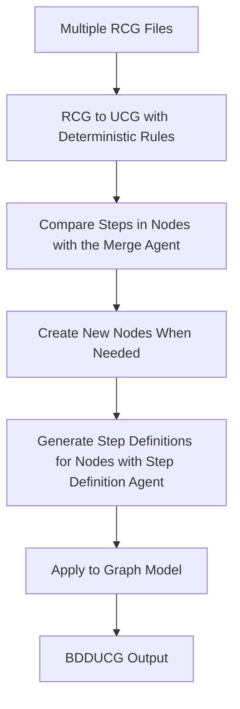
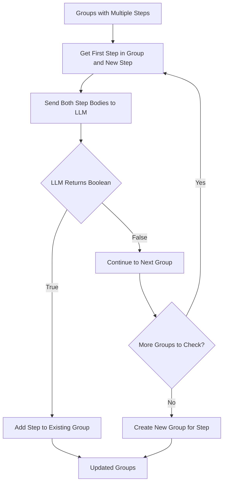
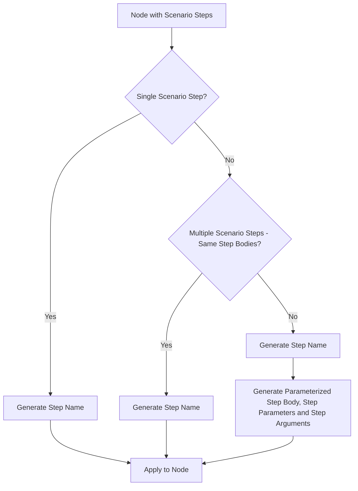

# High-Level Flow Diagram: Causal Graph Transformation from RCGs to BDDCG

## Main Transformation Flow

## Key Sub-Processes

### 1. Splitting of Nodes with the Merge Agent and Representative Step Comparison Algorithm

### 2. Generation of step definitions with Step Definition Agent

## Transformation Stages

1. **RCG → UCG with Deterministic Rules**
    - For Yuri to fill in

2. **Compare Steps of Nodes with LLM with a Representative Step Comparison Algorithm**
   - Extract step bodies from nodes of the UCG
   - Use representative step comparison algorithm (first step as representative)
   - LLM determines step similarity with "True"/"False" response
   - Steps compared against first step of each existing group sequentially until a similar group is found if not a new group is created
   - Sort groups by step execution order

3. **Generate Step Definitions for Nodes**
   - Generate step name with LLM for every node
   - For nodes with multiple different scenario steps: generate name, parameters, arguments, and parameterized body
   - For nodes with single or identical steps: generate name

4. **Apply to Graph Model**
   - Set node step names for all nodes
   - Set step body at the node level for all nodes
   - Set step parameters and arguments only for parameterized nodes
   - Clean up scenario-level step bodies

5. **BDDUCG Output**
   - Single optimized graph with new step names for all nodes
   - Parameterized step definitions only where scenarios differ

## Algorithm Details

### Merge Agent
- **Algorithm**: First step in group serves as representative
- **Comparison**: New step body compared against representative step body only
- **Decision**: First matching group (LLM returns "True") gets the step
- **Otherwise**: If no groups match, create new group

### Step Definition Agent
- **All Nodes**: Generate step name using LLM
- **Single Scenario Nodes**: Name only
- **Multiple Identical Scenarios**: Name only
- **Multiple Different Scenarios**: Full parameterization (name + parameters + arguments + body)

## Key Decision Points
- **Deterministic Rules and Merge Agent for RCGs to UCG Process Are Separate**: For now we first generate the UCG with deterministic rules and afterward split the groups based upon the decision of the MergeAgent, so the two operations are separate.
- **Step Body Similarity**: For now the LLM determines grouping decisions using representative comparison.
- **Single vs Identical vs Different Scenarios Linked to a Node**: Determines if parameterization is needed.