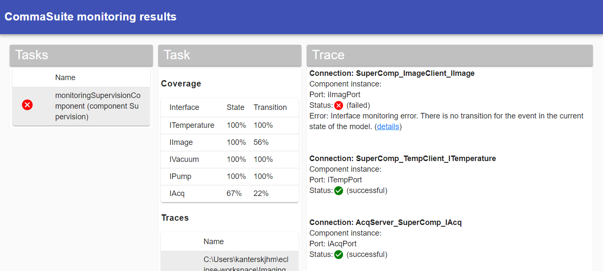

# CommaSuite impact analysis report
This CommaSuite impact analysis visualizes the CommaSuite output (`tasksResults.json`) and has been created using [React](https://reactjs.org/).

## Developing
To develop this report you need to have [Node.js 14+](https://nodejs.org/en/) installed.

After that execute the following commands to install the dependencies: `npm install`.

Next start the app using `npm start`, you can now access it via [http://localhost:3000](http://localhost:3000).

To create a release build execute `npm run build`. The output can be found in the `../resource` directory.

In development mode a test set will be loaded: [`src/testdata.js`](src/testdata.js). In the release build the data will be loaded from `window.report`. The release build will contain a placeholder for the data (`%REPORT%`) which is replaced by the actual data in `ExportToDashboard.java`.
